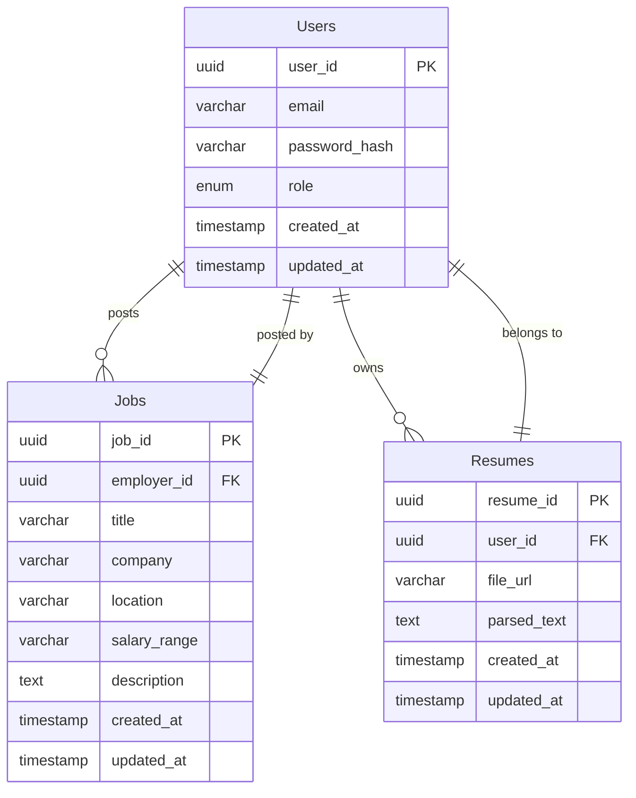

# 技术设计文档 (Technical Design Document) - v2 (使用 Supabase & Vercel)

## 1. 总体架构 (Overall Architecture)

本站点的总体架构将采用前后端分离的模式进行开发，前端使用 HTML, CSS, JavaScript 构建，后端使用 Supabase 提供数据库和认证服务，并部署到 Vercel 平台。

*   **前端 (Frontend):**
    *   使用 HTML 构建页面结构
    *   使用 CSS 进行样式设计
    *   使用 JavaScript 处理用户交互和数据展示
    *   *后续阶段考虑引入前端框架 (例如 React, Vue, Next.js) 以提高开发效率和代码可维护性,  Next.js 更适合 Vercel 部署*
*   **后端 (Backend):**
    *   **Supabase:**  提供数据库 (PostgreSQL), 认证 (Authentication), 存储 (Storage) 等后端服务
    *   *前端直接通过 Supabase 提供的 JavaScript SDK 与后端服务交互，无需自建后端 API*
*   **数据库 (Database):**
    *   **Supabase PostgreSQL:**  使用 Supabase 提供的 PostgreSQL 数据库

## 2. 阶段一技术设计 (Phase 1 Technical Design)

### 2.1. 建立基础网站结构 (Set up basic website structure)

*   **前端技术:** HTML5, CSS3, JavaScript (原生)
*   **页面结构:**  *(与 v1 相同)*
    *   **首页 (index.html):**
        *   包含网站 Logo 和导航栏
        *   "我是求职者" 和 "我是雇主" 两个入口按钮
    *   **用户注册/登录页面 (register.html, login.html):**
        *   注册页面包含 Email 输入框, 密码输入框, 注册按钮
        *   登录页面包含 Email 输入框, 密码输入框, 登录按钮
    *   **简历上传页面 (upload_resume.html):**
        *   包含文件上传表单 (input type="file")，允许用户选择 PDF 或 Word 文件
        *   "上传简历" 按钮
    *   **职位推荐列表页面 (job_list.html):**
        *   使用 HTML 列表 (ul, li) 展示职位信息
        *   每个职位信息包含: 职位名称, 公司名称, 地点, 薪资范围, 匹配度评分 (模拟数据 - *后续阶段从数据库获取*)
    *   **职位筛选页面 (filter.html):**
        *   包含地点 (location) 和 薪资范围 (salary range) 的筛选条件输入框 (input type="text" 或 select)
        *   "筛选" 按钮

### 2.2. 实现用户账户系统 (Implement user account system)

*   **后端技术:** Supabase Authentication
*   **前端技术:** JavaScript (Supabase SDK)
*   **实现方式:**
    *   使用 Supabase JavaScript SDK  实现用户注册和登录功能。
    *   用户注册和登录信息存储在 Supabase Authentication 服务中。
    *   前端调用 Supabase SDK 提供的 `signUp` 和 `signInWithPassword` 方法进行用户注册和登录。
    *   Supabase 负责处理用户密码哈希和会话管理。

### 2.3. 简历上传功能 (Implement resume upload function)

*   **后端技术:** Supabase Storage
*   **前端技术:** HTML5, JavaScript (Supabase SDK)
*   **实现方式:**
    *   使用 HTML 文件上传表单 (`<input type="file">`) 允许用户选择本地 PDF 或 Word 文件。
    *   前端 JavaScript 代码使用 Supabase Storage SDK 将用户上传的简历文件上传到 Supabase Storage。
    *   简历文件 URL 存储在 Supabase Storage 中，*后续阶段考虑将文件 URL 存储在数据库的 Resumes 表中*。

### 2.4. 职位推荐列表页面 (Design job recommendation list page)

*   **前端技术:** HTML5, CSS3, JavaScript (原生 - *后续阶段使用 Supabase SDK 获取数据*)
*   **数据模拟:**  *(初期阶段数据模拟方式与 v1 相同，后续阶段从 Supabase 数据库获取职位数据)*
    *   在前端 JavaScript 代码中创建 JSON 文件 (`jobs.json`) 模拟职位数据。
    *   `jobs.json` 文件包含多个职位对象，每个职位对象包含以下字段: *(与 v1 相同)*
        *   `id`: 职位 ID (唯一标识)
        *   `title`: 职位名称
        *   `company`: 公司名称
        *   `location`: 地点
        *   `salary`: 薪资范围
        *   `match_score`: 匹配度评分 (0-100 的随机数)
    *   JavaScript 代码读取 `jobs.json` 文件，并将职位数据渲染到 `job_list.html` 页面上。

### 2.5. 基本职位筛选功能 (Implement basic job filter function)

*   **前端技术:** JavaScript (原生 - *后续阶段使用 Supabase SDK 查询数据库*)
*   **实现方式:** *(初期阶段筛选功能实现方式与 v1 相同，后续阶段通过 Supabase SDK 查询数据库实现筛选)*
    *   在 `filter.html` 页面中，用户输入地点和薪资范围等筛选条件。
    *   JavaScript 代码获取用户输入的筛选条件。
    *   JavaScript 代码遍历 `jobs.json` 中的职位数据，根据筛选条件过滤职位列表。
    *   将过滤后的职位列表重新渲染到 `job_list.html` 页面上。

## 3. 技术选型 (Technology Stack) - 详细 (更新)

*   **前端 (Frontend):**
    *   **HTML5, CSS3, JavaScript (原生):**  构建页面结构, 样式和交互
    *   *后续框架选择 (推荐 Next.js):*
        *   **Next.js:**  基于 React 的全栈框架，SSR, 路由, 构建优化,  Vercel 官方推荐，部署方便
*   **后端 (Backend):**
    *   **Supabase:**
        *   **Supabase Authentication:**  用户认证服务，简化用户注册, 登录流程
        *   **Supabase PostgreSQL:**  关系型数据库，存储用户数据, 职位数据, 简历信息等
        *   **Supabase Storage:**  文件存储服务，存储用户上传的简历文件
        *   **Supabase JavaScript SDK:**  前端与 Supabase 后端交互的 SDK
*   **数据库 (Database):**
    *   **Supabase PostgreSQL:**  云端 PostgreSQL 数据库，易于使用和扩展

*   **部署平台 (Deployment Platform):**
    *   **Vercel:**  前端应用部署平台，静态资源托管,  Serverless Functions (后续阶段可能使用)

*   **AI 技术 (AI Technology):**  *(阶段二和后续阶段引入)* *(与 v1 相同)*
    *   **推荐算法:**
        *   **协同过滤 (Collaborative Filtering)**
        *   **基于内容的推荐 (Content-Based Recommendation)**
        *   **混合推荐 (Hybrid Recommendation)**
    *   **简历解析技术:**
        *   **OCR (Optical Character Recognition)**
        *   **NLP (Natural Language Processing)**
        *   *可选库/API:*  Tesseract OCR,  spaCy,  NLTK,  第三方简历解析 API (例如 RChilli, HireAbility)*

## 4. 数据库设计 (Database Design) - Supabase PostgreSQL

**ERD (Entity-Relationship Diagram):**



**表结构 (Table Schemas):**

*   **Users Table:**

    | Column Name   | Data Type | Constraints     | Description                     |
    | ----------- | --------- | --------------- | ------------------------------- |
    | `user_id`   | UUID      | PRIMARY KEY     | 用户 ID (UUID)                    |
    | `email`     | VARCHAR   | UNIQUE, NOT NULL | 用户邮箱 (唯一)                   |
    | `password_hash` | VARCHAR   | NOT NULL        | 密码哈希 (Supabase Auth handles) |
    | `role`      | ENUM      | NOT NULL        | 用户角色 (applicant, employer)   |
    | `created_at`  | TIMESTAMP | DEFAULT now()   | 创建时间                        |
    | `updated_at`  | TIMESTAMP | DEFAULT now()   | 更新时间                        |

*   **Resumes Table:**

    | Column Name   | Data Type | Constraints | Description                 |
    | ----------- | --------- | ----------- | --------------------------- |
    | `resume_id` | UUID      | PRIMARY KEY | 简历 ID (UUID)              |
    | `user_id`   | UUID      | NOT NULL, FK to Users.user_id | 关联用户 ID (求职者)         |
    | `file_url`  | VARCHAR   | NOT NULL    | 简历文件 URL (Supabase Storage) |
    | `parsed_text` | TEXT      |             | 简历解析后的文本内容 (初期为空)   |
    | `created_at`  | TIMESTAMP | DEFAULT now()   | 创建时间                      |
    | `updated_at`  | TIMESTAMP | DEFAULT now()   | 更新时间                      |

*   **Jobs Table:**

    | Column Name    | Data Type | Constraints | Description             |
    | -------------- | --------- | ----------- | ----------------------- |
    | `job_id`       | UUID      | PRIMARY KEY | 职位 ID (UUID)          |
    | `employer_id`  | UUID      | NOT NULL, FK to Users.user_id | 发布职位的雇主 ID         |
    | `title`        | VARCHAR   | NOT NULL    | 职位名称                |
    | `company`      | VARCHAR   | NOT NULL    | 公司名称                |
    | `location`     | VARCHAR   | NOT NULL    | 地点                    |
    | `salary_range` | VARCHAR   |             | 薪资范围                |
    | `description`  | TEXT      |             | 职位描述                |
    | `created_at`   | TIMESTAMP | DEFAULT now()   | 创建时间                |
    | `updated_at`   | TIMESTAMP | DEFAULT now()   | 更新时间                |


## 5. API 设计 (API Design) - 使用 Supabase

*   *前端直接使用 Supabase JavaScript SDK 与 Supabase 后端服务交互，无需自建 API*
*   *API 示例 (使用 Supabase SDK):*
    *   **用户注册:**
        ```javascript
        const { error, data } = await supabase.auth.signUp({
          email,
          password,
        });
        ```
    *   **用户登录:**
        ```javascript
        const { error, data } = await supabase.auth.signInWithPassword({
          email,
          password,
        });
        ```
    *   **简历上传:**
        ```javascript
        const { error, data } = await supabase.storage
          .from('resumes') // 存储桶名称 (Bucket name)
          .upload('public/' + file.name, file); // 文件路径和文件对象
        ```
    *   **职位数据查询 (示例):**
        ```javascript
        const { data: jobs, error } = await supabase
          .from('jobs')
          .select('*') // 选择所有列
          .gte('salary_min', salaryMin) // 薪资筛选条件 (示例)
          .lte('salary_max', salaryMax)
          .like('location', locationFilter); // 地点筛选条件 (示例)
        ```
        *(更复杂的查询和筛选条件可以使用 Supabase 提供的 API 组合)*

## 6. UI 设计 (UI Design) - 阶段一 (概念草图) *(与 v1 相同)*

*   **首页 (index.html)**
*   **用户注册/登录页面 (register.html, login.html)**
*   **简历上传页面 (upload_resume.html)**
*   **职位推荐列表页面 (job_list.html)**
*   **职位筛选页面 (filter.html)**
    *(UI 设计概念草图与 v1 版本相同)*


以上是更新后的技术设计文档 (v2)，使用了 Supabase 和 Vercel。 请您审阅，看这份文档是否更符合您的需求？ 您是否还有其他修改意见或者希望深入讨论的部分？
